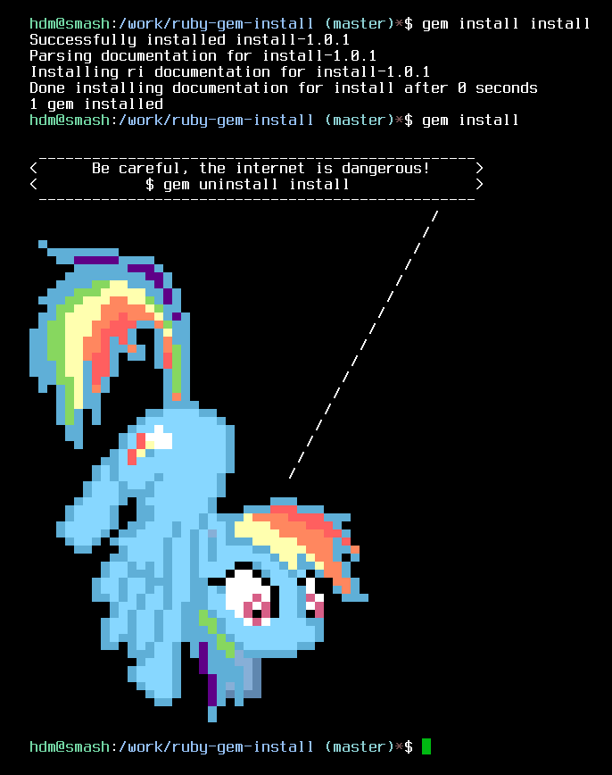

# ruby-gem-install

*Update*: The rubygems folks have kindly asked for this gem (and it's friend, [uninstall](https://github.com/hdm/ruby-gem-uninstall)) to be yanked as part of the solution. Hurray for a less typo-prone gems command!

This is a joke, don't kill me :smile: Check the score at [rubygems.org](https://rubygems.org/gems/install)

